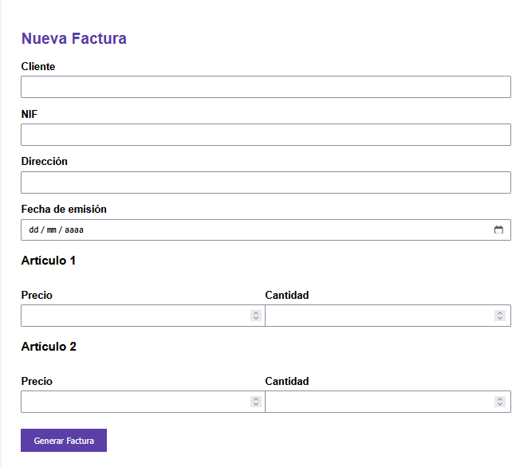

# 🧾 Sistema Automatizado de Generación y Envío de Facturas en PHP

## 📌 Introducción

Este proyecto consiste en el desarrollo de una aplicación web orientada a la automatización del proceso de generación y envío de facturas digitales en formato PDF.

El sistema permite que, a través de un formulario web, el usuario introduzca los datos necesarios para generar una factura estructurada profesionalmente. Posteriormente, la aplicación procesa la información, genera un documento en formato PDF utilizando la librería HTML2PDF y lo envía automáticamente por correo electrónico al cliente mediante PHPMailer.

La solución está diseñada para mejorar la eficiencia administrativa, reducir errores humanos y optimizar el flujo de trabajo en la gestión de facturación.

## 🎯 Objetivos del Sistema

- Automatizar la generación de facturas digitales.
- Reducir errores manuales en cálculos.
- Generar documentos PDF con formato profesional.
- Enviar facturas automáticamente por correo electrónico.
- Optimizar el proceso administrativo.

## 🔄 Flujo de Funcionamiento

1. El usuario introduce los datos en el formulario.
2. El sistema procesa y valida la información recibida.
3. Se genera dinámicamente el documento en formato HTML.
4. El documento HTML se convierte en PDF mediante HTML2PDF.
5. El PDF se envía automáticamente por correo electrónico al cliente.

## 🖼️ Vista del Sistema

A continuación se muestra la interfaz principal del sistema donde el usuario introduce los datos necesarios para la generación de la factura:

## 🛠️ Tecnologías y Librerías Utilizadas

- **PHP** → Lógica del lado del servidor.
- **HTML5** → Estructura del documento.
- **CSS3** → Diseño y presentación visual.
- **HTML2PDF** → Conversión de HTML a formato PDF.
- **PHPMailer** → Envío de correos electrónicos mediante SMTP.

Repositorio oficial del proyecto:

🔗 https://github.com/Noelia-PR2001/facturacion-php

## 📂 Estructura del Proyecto

| Archivo | Función |
|----------|----------|
| index.php | Formulario principal de entrada de datos |
| bill.php | Procesamiento de información y cálculos |
| generar_pdf.php | Generación del documento PDF |
| mail.php | Gestión del envío del correo electrónico |
| css.css | Definición del diseño visual |

---

## 🚀 Instalación y Ejecución

Para ejecutar el proyecto en un entorno local:

1. Copiar la carpeta del proyecto dentro de:
   C:\xampp\htdocs\
2. Iniciar Apache desde el panel de control de XAMPP.
3. Acceder desde el navegador a:
   http://localhost/proyecto_factura/
   
## ⚙️ Configuración del Servicio de Correo

Editar el archivo `mail.php` e introducir las credenciales SMTP correspondientes:

- Host SMTP  
- Usuario  
- Contraseña  
- Puerto  
- Tipo de cifrado (TLS/SSL)

## 🔒 Seguridad

- No se incluyen credenciales sensibles en el repositorio.
- Se recomienda proteger los datos SMTP en entornos de producción.
- El envío SMTP debe realizarse mediante conexión segura (TLS/SSL).

## 👩‍💻 Autor

Noelia Parra Rodríguez  

Proyecto desarrollado con fines formativos y aplicación profesional.
